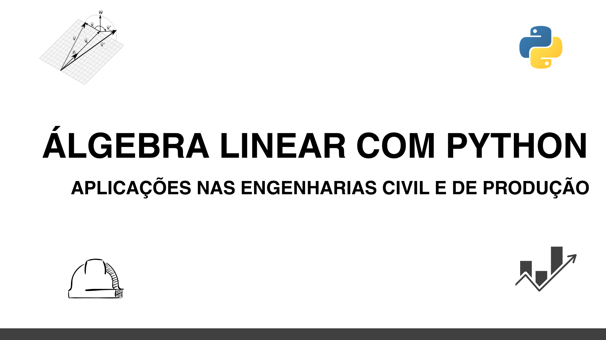

# Álgebra Linear com python: Aplicações nas engenharias civil e de produção

 

   

Este produto educacional constitui um dos resultados do projeto Ações em prol das disciplinas de Geometria Analítica e Álgebra Linear, por meio do Edital PROGRAD Nº 15/2024, sob a supervisão do Prof. Dr. Marcelo Pires.